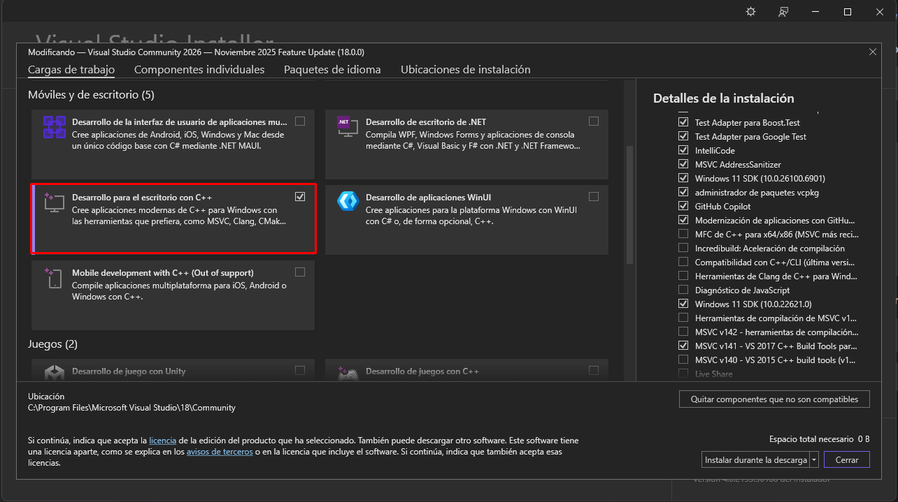

# Compilar extensión pgvector para PostgreSQL

> **Repositorio oficial:** [pgvector](https://github.com/pgvector/pgvector)

### Instalar "Visual Studio" con la carga de trabajo "Desarrollo para el escritorio con C++"



### Abrir la herramienta `x64 Native Tools Command Prompt for VS` como administrador (se debió instalar con Visual Studio)

### Clonar el repositorio en una ubicación temporal

```bash
git clone git@github.com:pgvector/pgvector.git
cd pgvector
```

> **Nota:** Puedes navegar a una ruta específica antes de clonar, por ejemplo `cd /D %TEMP%`.
> Si no tienes clave SSH configurada, usa HTTPS: `git clone https://github.com/pgvector/pgvector.git`

### Establecer la variable de entorno

```bash
set "PGROOT=E:\Program Files\PostgreSQL\17"
```

> **Nota:** Ajusta la ruta según la versión y ubicación de tu instalación de PostgreSQL.

### Ejecutar la compilación

```bash
nmake /F Makefile.win
```

> **Nota:** Si compila correctamente debería terminar en `1 archivo(s) copiado(s).`

### Instalar la extensión

```bash
nmake /F Makefile.win install
```

### Reiniciar PostgreSQL

```bash
net stop postgresql-x64-17
net start postgresql-x64-17
```

> **Nota:** Ajusta el nombre del servicio según tu versión de PostgreSQL (`postgresql-x64-16`, etc.).

### Validar si se instaló correctamente

```sql
SELECT name, default_version, installed_version
FROM pg_available_extensions
WHERE name = 'vector';
```

### Activar la extensión en la base de datos

> **Nota:** Conéctate primero a la base de datos donde deseas activar la extensión.

```sql
CREATE EXTENSION vector;
```
